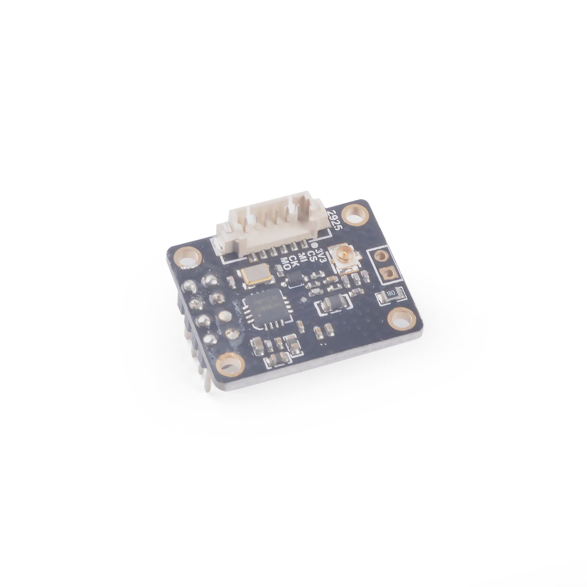
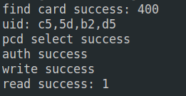

# SP_RFID Module User Guide

[中文](README_CN.md)

## Introduce


  * Use SP-MOD SPI to communicate with RFID Module
  * Control chip：The FM17510 is a highly integrated, contactless reader chip that works at 13.56MHz.
    Supports non-contact reader mode in accordance with ISO/IEC 14443 protocol
  * ISO14443 TYPEA supports communication rates of 106kbps，212kbps，424kbps
  * Size :25*20mm
  * 64Byte FIFO
  * The connection method :SP-MOD (2*4P 2.54mm space stitch)or MX 6P connector 1.25mm spaced

*See [Module Specification](doc/SP-RFID规格书V1.0.pdf) for more information.*

## Pin figure


## Mode of connection


|   MCU:FUN(IO)   | SP_RFID |
| :-------------: | :-----: |
|    NC(IO_7)     |   NPD   |
| SPI:MISO(IO_15) |   SO    |
| SPI:SS0(IO_20)  |   CS    |
| SPI:SCK(IO_21)  |   SCK   |
| SPI:MOSI(IO_8)  |   SI    |
|    NC(IO_6)     |   IRQ   |
|    2.2~3.6V     |  3.3V   |
|       GND       |   GND   |


## MCU configuration

### IO port configuration

Configure IO port corresponding to MCU as SPI function pin.

* C

  This demo uses a software SPI, so set the corresponding pin to GPIOHS instead of SPI function. See the full code for the implementation.
  ```c
    fpioa_set_function(RFID_CS_PIN, FUNC_GPIOHS0 + RFID_CS_HSNUM); // RFID_CS_PIN: 20;
    fpioa_set_function(RFID_CK_PIN, FUNC_GPIOHS0 + RFID_CK_HSNUM); // RFID_CK_PIN: 21;
    fpioa_set_function(RFID_MO_PIN, FUNC_GPIOHS0 + RFID_MO_HSNUM); // RFID_MO_PIN: 8;
    fpioa_set_function(RFID_MI_PIN, FUNC_GPIOHS0 + RFID_MI_HSNUM); // RFID_MI_PIN: 15;

    gpiohs_set_drive_mode(spi_io_cfg.hs_cs, GPIO_DM_OUTPUT);
    gpiohs_set_drive_mode(spi_io_cfg.hs_clk, GPIO_DM_OUTPUT);
    gpiohs_set_drive_mode(spi_io_cfg.hs_mosi, GPIO_DM_OUTPUT);
    gpiohs_set_drive_mode(spi_io_cfg.hs_miso, GPIO_DM_INPUT);
  ```
  
* MaixPy

  ```python
    # 20: CS_NUM;
    fm.register(20, fm.fpioa.GPIOHS20, force=True)
    # set gpiohs work mode to output mode
    cs = GPIO(GPIO.GPIOHS20, GPIO.OUT)
  ```

### SPI initialization

* C

  The software SPI only needs to be configured with the corresponding pins, and there is no initialization of SPI.

* MaixPy

  ```python
    # RFID_SCK: 21; RFID_SI:8; RFID_SO: 15;
    spi1 = SPI(SPI.SPI1, mode=SPI.MODE_MASTER, baudrate=600 * 1000,
            polarity=0, phase=0, bits=8, firstbit=SPI.MSB, sck=21, mosi=8, miso=15)
  ```

## SP_RFID configuration

### Usage

* Process

  1. Initialization
  2. Detected and bind card
  3. Read or write data

* C

  ```c
    // detected card
    PcdRequest(0x52, type)

    // auth and bind...

    // read or write 16 bytes data from sector 0x11
    PcdWrite(0x11, w_buf)
    PcdRead(0x11, &r_buf)
  ```
  
* MaixPy

  ```python
  # Create an object of the class MFRC522
    MIFAREReader = MFRC522(spi1, cs)
    
    # detected and auth, bind...
    
    # read or write 16 bytes data from sector 0x11
    MIFAREReader.MFRC522_Write(0x11, data)
    MIFAREReader.MFRC522_Read(0x11)
  ```

## Runtime environments

| Language |  Boards  |      SDK/Firmware version      |
| :------: | :------: | :----------------------------: |
|    C     | MaixCube | kendryte-standalone-sdk v0.5.6 |
|  MaixPy  | MaixCube |         maixpy v0.5.1          |

## Result

* C

  

* MaixPy

  

## LICENSE

See [LICENSE](LICENSE.md) file.

## Other information

| Version |   Editor   |
| :-----: | :--------: |
|  v0.1   | vamoosebbf |