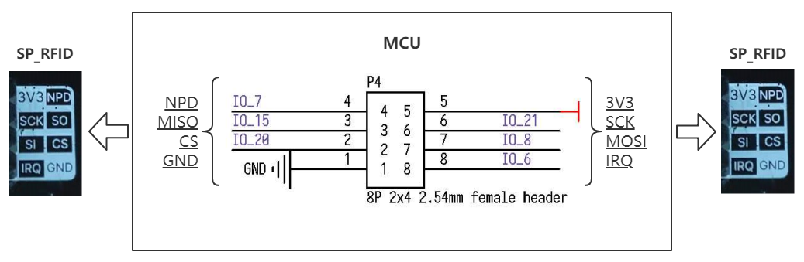
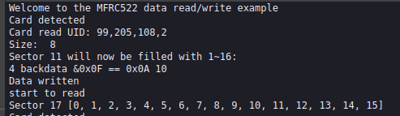

# SP_RFID 模块使用说明
    
[English](README.md)

## 目录结构

|  目录  | 描述           |
| :----: | :------------- |
|  doc   | 参考文档       |
|  img   | 图片           |
| script | MaixPy脚本示例 |
|  src   | C裸机程序示例  |
## 介绍


  * 利用 SP-MOD SPI 和 RFID 模块通讯
  * 主控芯片：FM17510 是一款高度集成的工作在 13.56MHz 下的非接触读写器芯片。
    支持符合 ISO/IEC 14443 TypeA 协议的非接触读写器模式
  * ISO14443 TYPEA 支持通讯速率 106kbps，212kbps，424kbps
  * 尺寸 :25*20mm
  * 64Byte 收发缓冲 FIFO
  * 连接方式 :SP-MOD (2*4P 2.54mm 间距排针)或 MX 6P 连接器 1.25mm 间距

*查看[模块规格书](doc/SP-RFID规格书V1.0.pdf)获取更多特性信息*

## 引脚图


## 接线方式



|   MCU:FUN(IO)   | SP_RFID |
| :-------------: | :-----: |
|    NC(IO_7)     |   NPD   |
| SPI:MISO(IO_15) |   SO    |
| SPI:SS0(IO_20)  |   CS    |
| SPI:SCK(IO_21)  |   SCK   |
| SPI:MOSI(IO_8)  |   SI    |
|    NC(IO_6)     |   IRQ   |
|    2.2~3.6V     |  3.3V   |
|       GND       |   GND   |

## MCU 配置

### IO 口配置

将 MCU 原理图对应的 IO 口配置为 SPI 功能引脚。

* C 示例
  
  此示例使用的是软件模拟 SPI，所以在此需将设置对应引脚为 GPIOHS 功能而不是 SPI 功能，具体实现请查看完整代码。
  ```c
  fpioa_set_function(RFID_CS_PIN, FUNC_GPIOHS0 + RFID_CS_HSNUM); // RFID_CS_PIN: 20;
  fpioa_set_function(RFID_CK_PIN, FUNC_GPIOHS0 + RFID_CK_HSNUM); // RFID_CK_PIN: 21;
  fpioa_set_function(RFID_MO_PIN, FUNC_GPIOHS0 + RFID_MO_HSNUM); // RFID_MO_PIN: 8;
  fpioa_set_function(RFID_MI_PIN, FUNC_GPIOHS0 + RFID_MI_HSNUM); // RFID_MI_PIN: 15;

  gpiohs_set_drive_mode(spi_io_cfg.hs_cs, GPIO_DM_OUTPUT);
  gpiohs_set_drive_mode(spi_io_cfg.hs_clk, GPIO_DM_OUTPUT);
  gpiohs_set_drive_mode(spi_io_cfg.hs_mosi, GPIO_DM_OUTPUT);
  gpiohs_set_drive_mode(spi_io_cfg.hs_miso, GPIO_DM_INPUT);
  ```

* MaixPy 示例

  ```python
  # 20: CS_NUM;
  fm.register(20, fm.fpioa.GPIOHS20, force=True)
  # set gpiohs work mode to output mode
  cs = GPIO(GPIO.GPIOHS20, GPIO.OUT)
  ```

### SPI 初始化

* C 示例

    软件 SPI 只需要配置对应引脚，并没有 SPI 的初始化。

* MaixPy 示例

  ```python
  # RFID_SCK: 21; RFID_SI:8; RFID_SO: 15;
  spi1 = SPI(SPI.SPI1, mode=SPI.MODE_MASTER, baudrate=600 * 1000,
          polarity=0, phase=0, bits=8, firstbit=SPI.MSB, sck=21, mosi=8, miso=15)
  ```

## SP_RFID 配置

### 使用方式

* 流程

  1. 初始化
  2. 扫描并绑定卡片
  3. 读写数据

* C 示例

  ```c
  // detected card
  PcdRequest(0x52, type)

  // auth and bind...

  // read or write 16 bytes data from sector 0x11
  PcdWrite(0x11, w_buf)
  PcdRead(0x11, &r_buf)
  ```
  
* MaixPy 示例

  ```python
  # Create an object of the class MFRC522
  MIFAREReader = MFRC522(spi1, cs)
  
  # detected and auth, bind...
  
  # read or write 16 bytes data from sector 0x11
  MIFAREReader.MFRC522_Write(0x11, data)
  MIFAREReader.MFRC522_Read(0x11)
  ```

## 运行环境

|  语言  |  开发板  |          SDK/固件版本          |
| :----: | :------: | :----------------------------: |
|   C    | MaixCube | kendryte-standalone-sdk v0.5.6 |
| MaixPy | MaixCube |         maixpy v0.5.1          |

## 运行结果

* C

  

* MaixPy

  

## 许可

请查看 [LICENSE](LICENSE.md) 文件.

## 相关信息

| 版本号 |   编辑人   |
| :----: | :--------: |
|  v0.1  | vamoosebbf |
